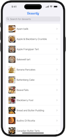
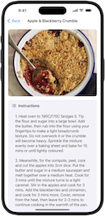
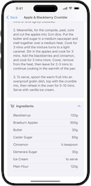

# Dessertly

**Dessertly** is an iOS app that provides a delightful experience for discovering and learning about desserts. It features a comprehensive list of desserts and detailed information about each one, making it easy to explore a variety of sweet treats.

This project serves as an example of modern, idiomatic Swift, that showcases the use of Swift Concurrency, SwiftUI, responsive design, and networking with REST APIs. Additionally, it uses the MVVM (Model-View-ViewModel) architecture design pattern, which promotes a clean separation of concerns and makes the codebase more maintainable and testable. It's designed to be both a practical app and a learning resource for developers to adopt best practices in Swift development.

[RxSwift version of this project](https://github.com/scotteg/Dessertly-RxSwift)

## Features

- Browse a list of desserts.
- View detailed information about each dessert, including ingredients and instructions.

## Screenshots

Click on the thumbnails to view the full-size images.

### Home Screen
[](Images/home-screen.png)

### Home Screen Dark Mode
[](Images/home-screen-dark.png)

### Home Screen Search
[](Images/home-screen-search.png)

### Dessert Detail Instructions
[](Images/dessert-detail-instructions.png)

### Dessert Detail Landscape
[](Images/dessert-detail-landscape.png)

### Dessert Detail Ingredients
[](Images/dessert-detail-ingredients.png)

## Installation

To install and run Dessertly, follow these steps:

1. Clone the repository:
```bash
git clone https://github.com/yourusername/Dessertly.git
```

2. Navigate to the project directory:
```bash
cd Dessertly
```

3. Open the project in Xcode:
```bash
open Dessertly.xcodeproj
```

4. Build and run the project using Xcode.

## Running Tests

To run the unit tests:

1. Open the project in Xcode.
2. Select the test target from the scheme menu.
3. Press `Cmd+U` to run all tests.

## Contributing

Contributions are welcome! Please submit a pull request or open an issue to discuss improvements or bugs.

## License

This project is licensed under the MIT License - see the [LICENSE](LICENSE.md) file for details.

## Contact

For any inquiries or feedback, please contact [scott.gardner@mac.com](mailto:scott.gardner@mac.com?subject=Dessertly%20app).
